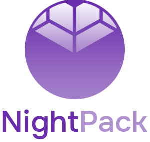

<p></p>
<p align="center">
  
</p>

# Introduction 👋

NightPack is a development framework based on [Webpack 4.x](https://webpack.js.org/). While many other frameworks offer ready-to-use UI solutions, NightPack gives you the maximum freedom to develop your own web interfaces. The ideological basis of the framework is the most useful utilities from [Bootstrap 4.x](https://getbootstrap.com/docs/4.6/getting-started/introduction/), many of which have been improved. NightPack uses best practices from [Material Design 2](https://material.io/) throughout. The framework is powered by [Webpack CLI 3.x](https://webpack.js.org/api/cli/), one of the most convenient tools for developing modern websites.

NightPack is build for Front-end developers who don't like rewriting the built-in styling solutions of third-party frameworks and plugins. It's for those who prefer to develop "from scratch". For those who need framework with ready-to-use UI solutions, we would recomend to use popular ones like [Bootstrap](https://bootstrap.org/), [Materialize](https://materializecss.com/), [Foundation](https://get.foundation/), or whatever you like.

# What's Included? 📦

**Modules:**
* webpack v4.43.0
* webpack-cli v3.3.12
* jquery v3.5.1
* babel v8.0.6
* sass-loader v8.0.0
* css-loader v3.2.0
* autoprefixer v9.8.4
* file-loader v6.0.0
* html-loader v0.5.5
* mini-css-extract-plugin v0.8.0
* pug-html-loader v1.1.5
* svg-sprite-loader v5.0.0"
* svg-url-loader v5.0.1"

**Features:**
* Hot-reload dev server
* Well organized file structure
* Pug templates support
* Scss/Sass support with prefixer
* Bunch of Scss mixins and functions
* Flexbox grid
* Normalize.css
* SVG sprite loader
* Images loader
* Fonts loader

# Getting Started 🖱

Clone repo and install dependencies
```
git clone https://github.com/nightrunner91/nightpack.git
npm i
```
Run hot-reload dev server
```
npm run watch
```
Build your project
```
npm run build
```

# File Structure 📂

```
.
├── src
│   ├── assets
│       ├── fonts
│       ├── icons
│       └── images
│   ├── scripts
│   └── components
│       app.js
│   ├── styles
│       ├── animations
│       ├── components
│       ├── core
│           └── helpers
│           functions.scss
│           globals.scss
│           mixins.scss
│           normalize.scss
│           typography.scss
│           varaibles.scss
│       ├── plugins
│       └── sections
│       style.scss
│   └── views
│       ├── core
│       ├── elements
│       ├── layouts
│       ├── sections
│       _mixins.pug
│       index.pug
│   index.js
|
|   webpack.config.js
```

# Documentation 📚

[ Coming Soon. Be sure. ]

_Although NightPack don't have documentation now, each file has it's own docs. Dive in /src folder to see it._

# To-do list Q3-Q4 2022 ✅

- [ ] Write documentation in README file
- [ ] Create landing page with presentation and documentation
- [ ] Release package on npmjs.com
